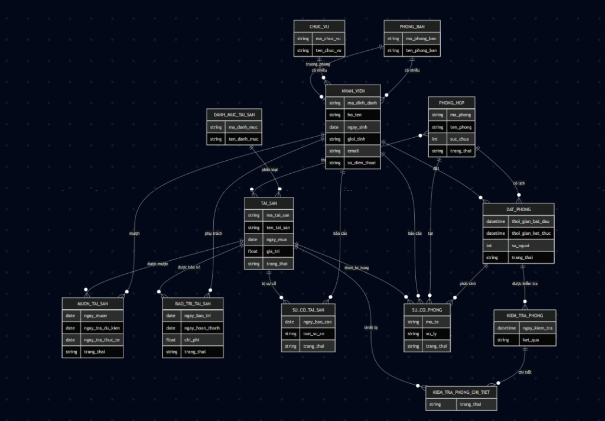

## BÁO CÁO BÀI TẬP LỚN
### HỆ THỐNG QUẢN LÝ NỘI BỘ DỰA TRÊN NỀN TẢNG ODOO
### Nhân sự – Tài sản – Phòng họp

#### 1. Thông tin chung
- **Nền tảng**: Odoo 15.0 Community
- **Ngôn ngữ lập trình**: Python 3, XML
- **Cơ sở dữ liệu**: PostgreSQL


---

## CHƯƠNG 1: TỔNG QUAN DỰ ÁN

### 1.1 Giới thiệu
Trong bối cảnh chuyển đổi số đang diễn ra mạnh mẽ, nhu cầu quản lý nội bộ doanh nghiệp bằng phần mềm tích hợp ngày càng trở nên cấp thiết. Bài tập lớn này xây dựng hệ thống quản lý nội bộ gồm 3 module tùy chỉnh (custom addons) trên nền tảng Odoo 15.0, bao gồm:

- **Module Nhân sự (`nhan_su`)** – Quản lý nhân viên, phòng ban, chức vụ.
- **Module Quản lý Tài sản (`quan_ly_tai_san`)** – Quản lý vòng đời tài sản doanh nghiệp.
- **Module Quản lý Phòng họp (`quan_ly_phong_hop`)** – Đặt phòng thông minh tích hợp AI.

Ba module được thiết kế tích hợp chặt chẽ với nhau, chia sẻ dữ liệu nhân viên và tài sản xuyên suốt các nghiệp vụ, tạo thành một hệ sinh thái quản lý thống nhất.

### 1.2 Mục tiêu

| **Mục tiêu** | **Mô tả** |
|--------------|-----------|
| Nghiệp vụ    | Số hóa quy trình quản lý nhân sự, tài sản và phòng họp |
| Kỹ thuật     | Xây dựng Odoo custom addon đúng chuẩn kiến trúc MVC |
| Tích hợp AI  | Ứng dụng Google Gemini API vào gợi ý phòng họp thông minh |
| Tự động hóa  | Tự động cập nhật trạng thái, kiểm tra xung đột, tạo yêu cầu bảo trì |


### 1.3 Phạm vi hệ thống
Hệ thống phục vụ các đối tượng người dùng sau:

- **Nhân viên**: Xem thông tin cá nhân, đặt phòng, mượn tài sản, báo sự cố.
- **Quản lý**: Duyệt yêu cầu mượn tài sản, duyệt đặt phòng, xem báo cáo.
- **Kỹ thuật viên**: Tiếp nhận và xử lý yêu cầu bảo trì tài sản.

### 1.4 Kiến trúc tổng thể

- **Nền tảng**: Odoo 15.0.
- **Các module chính**:
  - `nhan_su`: Nhân viên, Phòng ban, Chức vụ.
  - `quan_ly_tai_san`: Tài sản, Mượn tài sản, Bảo trì, Sự cố.
  - `quan_ly_phong_hop`: Phòng họp, Đặt phòng, AI Wizard.
- **Cơ sở dữ liệu**: PostgreSQL.
- **Dịch vụ AI**: Google Gemini 2.0 Flash.

Chuỗi phụ thuộc module:

> `nhan_su`  →  `quan_ly_tai_san`  →  `quan_ly_phong_hop`  
> (base)         (base, nhan_su)       (base, nhan_su, quan_ly_tai_san)

### 1.5 Công nghệ sử dụng

| **Thành phần**       | **Công nghệ**                                    |
|----------------------|--------------------------------------------------|
| Framework            | Odoo 15.0 (Python ORM + QWeb)                    |
| Ngôn ngữ backend     | Python 3                                         |
| Giao diện            | XML View (Form, List, Kanban, Search)            |
| Cơ sở dữ liệu        | PostgreSQL                                       |
| AI / NLP             | Google Gemini 2.0 Flash API                      |
| Giao tiếp HTTP       | `urllib.request` (thư viện chuẩn Python)         |
| Phân tích dự phòng   | Keyword matching tiếng Việt (offline fallback)   |

---

## CHƯƠNG 2: PHÂN TÍCH VÀ THIẾT KẾ HỆ THỐNG

### 2.1 Module Nhân sự (`nhan_su`)

#### 2.1.1 Mô tả nghiệp vụ
Module quản lý thông tin tổ chức nhân sự, là nền tảng cho toàn bộ hệ thống. Dữ liệu nhân viên được tái sử dụng ở tất cả các module còn lại qua cơ chế kế thừa (`_inherit`).

#### 2.1.2 Các Model dữ liệu

**Model `chuc_vu` – Chức vụ**

| Trường       | Kiểu dữ liệu | Ràng buộc          | Mô tả          |
|-------------|--------------|--------------------|-----------------|
| ma_chuc_vu  | Char         | required, unique   | Mã chức vụ      |
| ten_chuc_vu | Char         | required           | Tên chức vụ     |
| mo_ta       | Text         | —                  | Mô tả chi tiết  |

**Model `phong_ban` – Phòng ban**

| Trường         | Kiểu dữ liệu           | Ràng buộc        | Mô tả               |
|----------------|------------------------|------------------|---------------------|
| ma_phong_ban   | Char                   | required, unique | Mã phòng ban        |
| ten_phong_ban  | Char                   | required         | Tên phòng ban       |
| mo_ta          | Text                   | —                | Mô tả               |
| truong_phong   | Many2one → nhan_vien   | —                | Trưởng phòng        |
| nhan_vien_ids  | One2many → nhan_vien   | —                | Danh sách nhân viên |

**Model `nhan_vien` – Nhân viên**

| Trường        | Kiểu dữ liệu         | Ràng buộc        | Mô tả               |
|---------------|----------------------|------------------|---------------------|
| ma_dinh_danh  | Char                 | required, unique | Mã định danh        |
| ho_ten        | Char                 | required         | Họ và tên           |
| ngay_sinh     | Date                 | —                | Ngày sinh           |
| gioi_tinh     | Selection            | —                | Nam / Nữ / Khác     |
| hinh_anh      | Binary               | —                | Ảnh đại diện        |
| que_quan      | Char                 | —                | Quê quán            |
| dia_chi       | Char                 | —                | Địa chỉ             |
| email         | Char                 | —                | Email công việc     |
| so_dien_thoai | Char                 | —                | Số điện thoại       |
| phong_ban_id  | Many2one → phong_ban | —                | Phòng ban           |
| chuc_vu_id    | Many2one → chuc_vu   | —                | Chức vụ             |

#### 2.1.3 Sơ đồ quan hệ (ERD)

**a) Sơ đồ ERD 

Hình dưới đây minh họa trực quan các bảng và quan hệ trong hệ thống:



**b) Liệt kê các mối quan hệ chính**

- **Nhân sự**
  - `PHONG_BAN` 1–n `NHAN_VIEN`: một phòng ban có nhiều nhân viên, mỗi nhân viên thuộc đúng một phòng ban (`phong_ban_id`).
  - `CHUC_VU` 1–n `NHAN_VIEN`: một chức vụ có nhiều nhân viên, mỗi nhân viên giữ đúng một chức vụ (`chuc_vu_id`).
  - `PHONG_BAN` 1–1 `NHAN_VIEN` (truong_phong): mỗi phòng ban có một trưởng phòng là một nhân viên.

- **Tài sản**
  - `DANH_MUC_TAI_SAN` 1–n `TAI_SAN`: một danh mục có nhiều tài sản, mỗi tài sản thuộc một danh mục (`danh_muc_id`).
  - `TAI_SAN` 1–n `MUON_TAI_SAN`: một tài sản có thể được mượn nhiều lần, mỗi phiếu mượn gắn với một tài sản (`tai_san_id`).
  - `NHAN_VIEN` 1–n `MUON_TAI_SAN`: một nhân viên có thể mượn nhiều tài sản, mỗi phiếu mượn gắn với một nhân viên (`nhan_vien_id`).
  - `TAI_SAN` 1–n `BAO_TRI_TAI_SAN`: một tài sản có thể có nhiều lần bảo trì (`tai_san_id`).
  - `NHAN_VIEN` 1–n `BAO_TRI_TAI_SAN`: một nhân viên có thể phụ trách nhiều phiếu bảo trì (`nhan_vien_phu_trach`).
  - `TAI_SAN` 1–n `SU_CO_TAI_SAN`: một tài sản có thể có nhiều sự cố (`tai_san_id`).
  - `NHAN_VIEN` 1–n `SU_CO_TAI_SAN`: một nhân viên có thể báo nhiều sự cố (`nhan_vien_bao_cao`).

- **Phòng họp**
  - `PHONG_HOP` 1–n `DAT_PHONG`: một phòng họp có nhiều lịch đặt (`phong_hop_id`).
  - `NHAN_VIEN` 1–n `DAT_PHONG`: một nhân viên có thể đặt nhiều lịch (`nhan_vien_id`).
  - `DAT_PHONG` 1–n `KIEM_TRA_PHONG`: một lịch họp có thể có nhiều biên bản kiểm tra (`dat_phong_id`).
  - `KIEM_TRA_PHONG` 1–n `KIEM_TRA_PHONG_CHI_TIET`: một biên bản có nhiều dòng kiểm tra thiết bị (`kiem_tra_id`).
  - `TAI_SAN` 1–n `KIEM_TRA_PHONG_CHI_TIET`: mỗi thiết bị trong phòng được ghi nhận trong nhiều dòng kiểm tra (`tai_san_id`).
  - `PHONG_HOP` n–n `TAI_SAN`: một phòng họp có nhiều thiết bị và một thiết bị có thể gắn với nhiều phòng họp (`thiet_bi_ids` – quan hệ Many2many).
  - `DAT_PHONG` 1–n `SU_CO_PHONG`: một lịch họp có thể phát sinh nhiều sự cố (`dat_phong_id`).
  - `PHONG_HOP` 1–n `SU_CO_PHONG`: một phòng họp có thể có nhiều sự cố (`phong_hop_id`). 
  - `NHAN_VIEN` 1–n `SU_CO_PHONG`: một nhân viên có thể báo nhiều sự cố phòng (`nhan_vien_bao_cao`, `nhan_vien_sua`).
  - `TAI_SAN` 1–n `SU_CO_PHONG`: một thiết bị có thể là nguyên nhân của nhiều sự cố phòng (`thiet_bi_hong`).

---

### 2.2 Module Quản lý Tài sản (`quan_ly_tai_san`)

#### 2.2.1 Mô tả nghiệp vụ
Module quản lý toàn bộ vòng đời tài sản doanh nghiệp từ khi nhập về đến khi thanh lý, bao gồm: theo dõi hồ sơ, cho mượn, bảo trì và xử lý sự cố.

#### 2.2.2 Các Model dữ liệu

**Model `danh_muc_tai_san` – Danh mục tài sản**

| Trường        | Kiểu dữ liệu | Ràng buộc        | Mô tả            |
|---------------|--------------|------------------|------------------|
| ma_danh_muc   | Char         | required, unique | Mã danh mục      |
| ten_danh_muc  | Char         | required         | Tên danh mục     |
| mo_ta         | Text         | —                | Mô tả            |
| tai_san_ids   | One2many → tai_san | —          | Danh sách tài sản |

**Model `tai_san` – Hồ sơ tài sản**

| Trường      | Kiểu dữ liệu             | Ràng buộc                  | Mô tả                |
|-------------|--------------------------|----------------------------|----------------------|
| ma_tai_san  | Char                     | required, unique           | Mã tài sản           |
| ten_tai_san | Char                     | required                   | Tên tài sản          |
| danh_muc_id | Many2one → danh_muc_tai_san | required                | Danh mục             |
| hinh_anh    | Binary                   | —                          | Hình ảnh minh họa    |
| ngay_mua    | Date                     | —                          | Ngày mua             |
| gia_tri     | Float                    | —                          | Giá trị (VNĐ)        |
| vi_tri      | Char                     | —                          | Vị trí lưu trữ       |
| mo_ta       | Text                     | —                          | Mô tả chi tiết       |
| trang_thai  | Selection                | required, default='san_sang' | Trạng thái hiện tại |

Giá trị `trang_thai` ví dụ:

| Giá trị    | Nhãn hiển thị |
|-----------|---------------|
| san_sang  | Sẵn sàng      |
| dang_muon | Đang cho mượn |
| bao_tri   | Đang bảo trì  |
| hong      | Hỏng          |
| mat       | Mất           |

**Model `muon_tai_san` – Phiếu mượn tài sản**

| Trường             | Kiểu dữ liệu          | Mô tả                                          |
|--------------------|-----------------------|------------------------------------------------|
| tai_san_id         | Many2one → tai_san    | Tài sản mượn                                   |
| nhan_vien_id       | Many2one → nhan_vien  | Nhân viên mượn                                 |
| ngay_muon          | Date                  | Ngày mượn (mặc định: hôm nay)                  |
| ngay_tra_du_kien   | Date                  | Ngày trả dự kiến                               |
| ngay_tra_thuc_te   | Date                  | Ngày trả thực tế (tự cập nhật khi trả)         |
| ghi_chu            | Text                  | Ghi chú                                        |
| trang_thai         | Selection             | Yêu cầu → Đã duyệt → Đang mượn → Đã trả / Hủy  |

**Model `bao_tri_tai_san` – Phiếu bảo trì**

| Trường             | Kiểu dữ liệu          | Mô tả                                 |
|--------------------|-----------------------|---------------------------------------|
| tai_san_id         | Many2one → tai_san    | Tài sản cần bảo trì                   |
| ngay_bao_tri       | Date                  | Ngày bắt đầu bảo trì                  |
| ngay_hoan_thanh    | Date                  | Ngày hoàn thành                       |
| chi_phi            | Float                 | Chi phí bảo trì (VNĐ)                 |
| mo_ta              | Text                  | Mô tả công việc bảo trì               |
| nhan_vien_phu_trach| Many2one → nhan_vien  | Nhân viên phụ trách                   |
| trang_thai         | Selection             | Chờ xử lý → Đang bảo trì → Hoàn thành |

**Model `su_co_tai_san` – Báo mất / hỏng tài sản**

| Trường             | Kiểu dữ liệu          | Mô tả                              |
|--------------------|-----------------------|------------------------------------|
| tai_san_id         | Many2one → tai_san    | Tài sản bị sự cố                   |
| nhan_vien_bao_cao  | Many2one → nhan_vien  | Người báo cáo                      |
| ngay_bao_cao       | Date                  | Ngày báo cáo                       |
| mo_ta              | Text                  | Mô tả sự cố                        |
| loai_su_co         | Selection             | Hỏng / Mất                         |
| trang_thai         | Selection             | Mới báo → Đang xử lý → Đã xử lý    |
| hanh_dong          | Selection             | Gửi sửa chữa / Thay thế / Thanh lý |

#### 2.2.3 Workflow Mượn Tài sản
- Bước 1: Nhân viên tạo phiếu `muon_tai_san` ở trạng thái **Yêu cầu**.
- Bước 2: Quản lý duyệt (`action_duyet`) → trạng thái **Đã duyệt**, kiểm tra `tai_san.trang_thai == 'san_sang'`.
- Bước 3: Thực hiện giao tài sản (`action_giao`) → phiếu sang **Đang mượn**, `tai_san.trang_thai = 'dang_muon'`.
- Bước 4: Khi trả (`action_tra`) → phiếu **Đã trả**, `tai_san.trang_thai = 'san_sang'`, tự cập nhật `ngay_tra_thuc_te`.
- Có thể hủy phiếu ở các bước trung gian với điều kiện phù hợp.

Ràng buộc kỹ thuật:
- `@api.constrains`: `ngay_tra_du_kien` phải sau hoặc bằng `ngay_muon`.
- `_sql_constraints`: Mã tài sản, mã danh mục phải duy nhất.

#### 2.2.4 Sơ đồ quan hệ (ERD)
`danh_muc_tai_san` – `tai_san` (One2many/Many2one), `tai_san` – `muon_tai_san` (One2many/Many2one), `tai_san` – `bao_tri_tai_san` (One2many/Many2one), `tai_san` – `su_co_tai_san` (One2many/Many2one), và các quan hệ tới `nhan_vien`.

---

### 2.3 Module Quản lý Phòng họp (`quan_ly_phong_hop`)

#### 2.3.1 Mô tả nghiệp vụ
Module đặt phòng họp thông minh với các tính năng nổi bật:

- Kiểm tra xung đột lịch tự động.
- Tối ưu sức chứa – cảnh báo khi phòng quá lớn/nhỏ.
- AI gợi ý phòng bằng Google Gemini từ ngôn ngữ tự nhiên.
- Kiểm tra thiết bị sau khi trả phòng.
- Xử lý sự cố tự động tạo yêu cầu bảo trì tài sản.

#### 2.3.2 Các Model dữ liệu

**Model `phong_hop` – Phòng họp**

| Trường        | Kiểu dữ liệu             | Mô tả                                    |
|---------------|--------------------------|------------------------------------------|
| ma_phong      | Char (unique)            | Mã phòng                                 |
| ten_phong     | Char (required)          | Tên phòng                                |
| vi_tri        | Char                     | Vị trí (tầng, tòa nhà)                   |
| suc_chua      | Integer (required)       | Sức chứa (người)                         |
| mo_ta         | Text                     | Mô tả phòng                              |
| hinh_anh      | Binary                   | Hình ảnh                                 |
| trang_thai    | Selection                | Sẵn sàng / Đang sử dụng / Đang bảo trì   |
| thiet_bi_ids  | Many2many → tai_san      | Thiết bị trang bị trong phòng            |
| dat_phong_ids | One2many → dat_phong     | Lịch đặt phòng                           |

**Model `dat_phong` – Phiếu đặt phòng họp**

| Trường             | Kiểu dữ liệu            | Mô tả                                             |
|--------------------|-------------------------|---------------------------------------------------|
| phong_hop_id       | Many2one → phong_hop    | Phòng họp đặt                                     |
| nhan_vien_id       | Many2one → nhan_vien    | Người đặt phòng                                   |
| thoi_gian_bat_dau  | Datetime                | Thời gian bắt đầu                                 |
| thoi_gian_ket_thuc | Datetime                | Thời gian kết thúc                                |
| so_nguoi           | Integer                 | Số người tham gia                                 |
| muc_dich           | Char                    | Mục đích sử dụng                                  |
| ghi_chu            | Text                    | Ghi chú thêm                                      |
| trang_thai         | Selection               | Nháp → Đã duyệt → Đang sử dụng → Hoàn thành / Hủy |
| canh_bao_suc_chua  | Char (computed)         | Cảnh báo tự động sức chứa                         |

**Model `kiem_tra_phong` – Biên bản kiểm tra phòng**

| Trường              | Kiểu dữ liệu                       | Mô tả                                   |
|---------------------|------------------------------------|-----------------------------------------|
| dat_phong_id        | Many2one → dat_phong               | Đặt phòng liên quan                     |
| phong_hop_id        | Many2one (related)                 | Phòng họp (tự động)                     |
| nhan_vien_kiem_tra  | Many2one → nhan_vien               | Người kiểm tra                          |
| ngay_kiem_tra       | Datetime                           | Thời điểm kiểm tra                      |
| ket_qua             | Selection                          | Đạt / Thiếu thiết bị / Có thiết bị hỏng |
| chi_tiet_ids        | One2many → kiem_tra_phong_chi_tiet | Chi tiết từng thiết bị                  |

**Model `kiem_tra_phong_chi_tiet` – Chi tiết kiểm tra từng thiết bị**

| Trường        | Kiểu dữ liệu              | Mô tả                  |
|---------------|---------------------------|------------------------|
| kiem_tra_id   | Many2one → kiem_tra_phong | Biên bản kiểm tra      |
| tai_san_id    | Many2one → tai_san        | Thiết bị kiểm tra      |
| trang_thai    | Selection                 | Tốt / Hỏng / Mất       |
| ghi_chu       | Char                      | Ghi chú                |

**Model `su_co_phong` – Sự cố phòng họp**

| Trường             | Kiểu dữ liệu            | Mô tả                           |
|--------------------|-------------------------|---------------------------------|
| dat_phong_id       | Many2one → dat_phong    | Đặt phòng liên quan             |
| phong_hop_id       | Many2one (related)      | Phòng họp                       |
| nhan_vien_bao_cao  | Many2one → nhan_vien    | Người báo cáo                   |
| mo_ta              | Text                    | Mô tả sự cố                     |
| thiet_bi_hong      | Many2one → tai_san      | Thiết bị bị hỏng                |
| xu_ly              | Selection               | Đổi phòng / Gọi sửa chữa        |
| trang_thai         | Selection               | Mới báo → Đang xử lý → Đã xử lý |
| phong_moi_id       | Many2one → phong_hop    | Phòng đổi sang                  |
| nhan_vien_sua      | Many2one → nhan_vien    | Nhân viên sửa chữa              |

#### 2.3.3 Workflow Đặt phòng họp
- Trạng thái ban đầu: **Nháp** – hệ thống tự kiểm tra xung đột lịch và sức chứa.
- Khi được duyệt (`action_duyet`) → trạng thái **Đã duyệt**.
- Khi bắt đầu họp (`action_bat_dau`) → trạng thái **Đang sử dụng**, `phong_hop.trang_thai = 'dang_su_dung'`.
- Trong khi họp có thể phát sinh `su_co_phong`.
- Kết thúc (`action_hoan_thanh`) → trạng thái **Hoàn thành**, phòng họp quay về **Sẵn sàng** (nếu không còn lịch khác), sau đó có thể tạo `kiem_tra_phong`.

#### 2.3.4 Tính năng AI Gợi ý Phòng (`goi_y_phong_wizard`)
Người dùng nhập yêu cầu bằng ngôn ngữ tự nhiên (ví dụ: "phòng họp 20 người có máy chiếu và loa"). Hệ thống xử lý theo hai bước:

- **Bước 1 – Gemini API**: Gửi prompt tới Google Gemini 2.0 Flash để trích xuất:
  - Số lượng người.
  - Thiết bị yêu cầu.
  - Khung giờ, thời lượng (nếu có).
- **Bước 2 – Xử lý nội bộ**:
  - Fallback keyword matching tiếng Việt nếu AI không phản hồi.
  - Lọc danh sách phòng đáp ứng sức chứa và thiết bị.
  - Kiểm tra xung đột lịch.
  - Tính điểm phù hợp (0–100) và xếp hạng phòng gợi ý.

Người dùng có thể chọn một gợi ý để tạo record `dat_phong` trực tiếp.

#### 2.3.5 Xử lý Sự cố Tự động
Khi xảy ra sự cố thiết bị hỏng trong phòng họp, hành động xử lý có thể tự động tạo phiếu bảo trì tài sản và cập nhật trạng thái thiết bị, ví dụ:

```python
def action_goi_sua_chua(self):
    for rec in self:
        self.env['bao_tri_tai_san'].create({
            'tai_san_id': rec.thiet_bi_hong.id,
            'mo_ta': 'Sự cố tại phòng %s: %s' % (rec.phong_hop_id.ten_phong, rec.mo_ta),
        })
        rec.thiet_bi_hong.trang_thai = 'hong'
```

Qua đó, `quan_ly_phong_hop` được liên kết chặt chẽ với `quan_ly_tai_san`.

---

### 2.4 Tích hợp Liên Module

#### 2.4.1 Ma trận tích hợp

| Quan hệ                        | Module A            | Module B              | Kiểu tích hợp                                    |
|--------------------------------|---------------------|-----------------------|--------------------------------------------------|
| Nhân viên mượn tài sản         | `nhan_su`           | `quan_ly_tai_san`     | Foreign key `nhan_vien_id`                       |
| Nhân viên phụ trách bảo trì    | `nhan_su`           | `quan_ly_tai_san`     | Foreign key `nhan_vien_phu_trach`                |
| Thiết bị trong phòng họp       | `quan_ly_tai_san`   | `quan_ly_phong_hop`   | Many2many (`tai_san` ↔ `phong_hop`)              |
| Nhân viên đặt phòng            | `nhan_su`           | `quan_ly_phong_hop`   | Foreign key `nhan_vien_id`                       |
| Sự cố phòng → Bảo trì tài sản  | `quan_ly_phong_hop` | `quan_ly_tai_san`     | Tự tạo record `bao_tri_tai_san` từ `su_co_phong` |
| Kế thừa model nhân viên        | `nhan_su`           | 2 module còn lại      | `_inherit = 'nhan_vien'`                         |

#### 2.4.2 Kịch bản nghiệp vụ tích hợp điển hình
**Kịch bản: Tổ chức buổi đào tạo nội bộ**

1. `[nhan_su]` Quản lý xác nhận danh sách 20 nhân viên tham gia.
2. `[quan_ly_tai_san]` Mượn 1 máy chiếu (ví dụ: TS005) → Duyệt → Giao.
3. `[quan_ly_phong_hop - AI]` Nhập "phòng đào tạo 20 người có máy chiếu loa" → Gemini AI phân tích → Gợi ý "Phòng Đào tạo A".
4. `[quan_ly_phong_hop]` Tạo phiếu đặt phòng → Duyệt → Bắt đầu.
5. `[quan_ly_phong_hop]` Trong buổi: máy chiếu bị hỏng → Báo sự cố → Tự động tạo phiếu bảo trì bên `quan_ly_tai_san`.
6. `[quan_ly_phong_hop]` Kết thúc → Kiểm tra phòng → Ghi biên bản.
7. `[quan_ly_tai_san]` Bảo trì máy chiếu hoàn thành → `trang_thai = 'san_sang'`.

---

## CHƯƠNG 3: CÀI ĐẶT VÀ KẾT QUẢ

### 3.1 Cấu trúc thư mục dự án
```text
btl/
└── addons/
    ├── nhan_su/
    │   ├── __manifest__.py
    │   ├── __init__.py
    │   ├── models/
    │   │   ├── chuc_vu.py
    │   │   ├── phong_ban.py
    │   │   └── nhan_vien.py
    │   ├── views/
    │   │   ├── chuc_vu.xml
    │   │   ├── phong_ban.xml
    │   │   ├── nhan_vien.xml
    │   │   └── menu.xml
    │   ├── security/
    │   │   └── ir.model.access.csv
    │   └── data/
    │       └── demo_data.xml
    │
    ├── quan_ly_tai_san/
    │   ├── __manifest__.py
    │   ├── __init__.py
    │   ├── models/
    │   │   ├── danh_muc_tai_san.py
    │   │   ├── tai_san.py
    │   │   ├── muon_tai_san.py
    │   │   ├── bao_tri_tai_san.py
    │   │   ├── su_co_tai_san.py
    │   │   └── nhan_vien_inherit.py
    │   ├── views/
    │   │   ├── danh_muc_tai_san.xml
    │   │   ├── tai_san.xml
    │   │   ├── muon_tai_san.xml
    │   │   ├── bao_tri_tai_san.xml
    │   │   ├── su_co_tai_san.xml
    │   │   ├── nhan_vien_inherit.xml
    │   │   └── menu.xml
    │   └── data/
    │       └── demo_data.xml
    │
    └── quan_ly_phong_hop/
        ├── __manifest__.py
        ├── __init__.py
        ├── models/
        │   ├── phong_hop.py
        │   ├── dat_phong.py
        │   ├── kiem_tra_phong.py
        │   ├── su_co_phong.py
        │   └── nhan_vien_inherit.py
        ├── views/
        │   ├── phong_hop.xml
        │   ├── dat_phong.xml
        │   ├── kiem_tra_phong.xml
        │   ├── su_co_phong.xml
        │   ├── nhan_vien_inherit.xml
        │   └── menu.xml
        ├── wizard/
        │   ├── goi_y_phong_wizard.py
        │   └── goi_y_phong_view.xml
        └── data/
            └── demo_data.xml
```


### 3.2 Dữ liệu demo được tạo

**Module Nhân sự**

| Loại     | Số lượng | Ví dụ dữ liệu                                                                          |
|----------|----------|----------------------------------------------------------------------------------------|
| Chức vụ  | 5        | Giám đốc, Trưởng phòng, Phó phòng, Nhân viên, Thực tập sinh                            |
| Phòng ban| 5        | CNTT (PB001), Nhân sự (PB002), Kinh doanh (PB003), Kế toán (PB004), Hành chính (PB005) |
| Nhân viên| 10       | NV001→NV010 (đầy đủ thông tin: họ tên, ngày sinh, liên hệ, phòng ban, chức vụ)         |

**Phân bố nhân viên theo phòng ban**

| Phòng ban         | Trưởng phòng                                | Số NV |
|-------------------|---------------------------------------------|-------|
| CNTT (PB001)      | Nguyễn Văn An (NV001 - GĐ)                  | 3     |
| Nhân sự (PB002)   | Trần Thị Bích (NV002 - TP)                  | 2     |
| Kinh doanh (PB003)| Lê Hoàng Cường (NV003 - TP)                 | 2     |
| Kế toán (PB004)   | Hoàng Thị Hoa (NV005 - TP)                  | 1     |
| Hành chính (PB005)| Võ Thanh Giang (NV006 - NV)                 | 2     |

### 3.3 Kết quả đạt được

#### 3.3.1 Chức năng đã hoàn thiện

| STT | Tính năng                                    | Module               | Trạng thái      |
|-----|----------------------------------------------|----------------------|-----------------|
| 1   | Quản lý nhân viên, phòng ban, chức vụ        | `nhan_su`            | ✅ Hoàn thành   |
| 2   | Hồ sơ tài sản với danh mục phân loại         | `quan_ly_tai_san`    | ✅ Hoàn thành   |
| 3   | Workflow mượn tài sản 4 bước                 | `quan_ly_tai_san`    | ✅ Hoàn thành   |
| 4   | Quản lý bảo trì tài sản                      | `quan_ly_tai_san`    | ✅ Hoàn thành   |
| 5   | Báo mất/hỏng tài sản                         | `quan_ly_tai_san`    | ✅ Hoàn thành   |
| 6   | Quản lý thông tin phòng họp + thiết bị       | `quan_ly_phong_hop`  | ✅ Hoàn thành   |
| 7   | Kiểm tra xung đột lịch đặt phòng             | `quan_ly_phong_hop`  | ✅ Hoàn thành   |
| 8   | Cảnh báo tối ưu sức chứa (computed)          | `quan_ly_phong_hop`  | ✅ Hoàn thành   |
| 9   | AI gợi ý phòng (Google Gemini)               | `quan_ly_phong_hop`  | ✅ Hoàn thành   |
| 10  | Kiểm tra phòng sau khi trả                   | `quan_ly_phong_hop`  | ✅ Hoàn thành   |
| 11  | Xử lý sự cố phòng họp                        | `quan_ly_phong_hop`  | ✅ Hoàn thành   |
| 12  | Tự động tạo bảo trì từ sự cố phòng           | Liên module          | ✅ Hoàn thành   |

#### 3.3.2 Thống kê kỹ thuật

| Chỉ số                                  | Giá trị                          |
|-----------------------------------------|----------------------------------|
| Tổng số module                          | 3                                |
| Tổng số Model (class)                   | 11 models + 1 `TransientModel`   |
| Tổng số View XML                        | 16 file                          |
| Tổng số phương thức nghiệp vụ           | ~18 action methods               |
| Số ràng buộc dữ liệu (`@api.constrains`)| 4                                |
| Số ràng buộc SQL (`_sql_constraints`)   | 6                                |
| Dòng code Python (ước tính)             | ~1.200 dòng                      |
| Dòng code XML (ước tính)                | ~850 dòng                        |

### 3.4 Điểm nổi bật của hệ thống
- **Tích hợp AI thực tiễn**: Sử dụng Google Gemini 2.0 Flash để xử lý ngôn ngữ tự nhiên, giúp người dùng tìm phòng họp chỉ bằng cách mô tả nhu cầu thay vì điền form phức tạp.
- **Tích hợp liên module chặt chẽ**: 3 module hoạt động như một hệ thống thống nhất; sự cố ở phòng họp tự động tạo phiếu bảo trì tài sản mà không cần thao tác thủ công.
- **Tự động hóa workflow**: Trạng thái tài sản và phòng họp được cập nhật tự động theo từng bước trong workflow, đảm bảo tính nhất quán dữ liệu.
- **Kiểm soát dữ liệu nghiêm ngặt**: Kiểm tra xung đột lịch đặt phòng theo thời gian thực, không cho mượn tài sản khi không ở trạng thái sẵn sàng, mã định danh duy nhất cho các entity chính.

### 3.5 Hướng phát triển tiếp theo

| Hướng phát triển          | Mô tả                                                                |
|---------------------------|----------------------------------------------------------------------|
| Báo cáo thống kê          | Dashboard tổng hợp: tỉ lệ sử dụng phòng, tài sản hay hỏng nhất       |
| Thông báo tự động         | Gửi email/SMS khi đặt phòng được duyệt, nhắc nhở trả tài sản         |
| Ứng dụng di động          | Tích hợp Odoo mobile app để đặt phòng/mượn tài sản qua điện thoại    |
| Nhận dạng QR              | Mã QR cho từng tài sản và phòng họp để tra cứu nhanh                 |
| Calendar view             | Xem lịch đặt phòng dạng lịch tuần/tháng                              |
| Tích hợp Google Calendar  | Đồng bộ lịch họp với Google Calendar của nhân viên                   |

---

## KẾT LUẬN
Hệ thống Quản lý Nhân sự – Tài sản – Phòng họp trên nền tảng Odoo 15.0 đã được xây dựng với đầy đủ các chức năng nghiệp vụ cốt lõi. Điểm nổi bật của dự án là tích hợp AI thực tiễn (Google Gemini) vào bài toán quản lý doanh nghiệp, cùng với cơ chế tích hợp liên module tự động giúp giảm thiểu thao tác thủ công và đảm bảo tính nhất quán của dữ liệu xuyên suốt hệ thống. Trong tương lai, việc mở rộng thêm các tính năng báo cáo, thông báo và tích hợp lịch ngoài (Google Calendar) sẽ giúp hệ thống hoàn thiện hơn và sẵn sàng ứng dụng trong môi trường doanh nghiệp thực tế.

